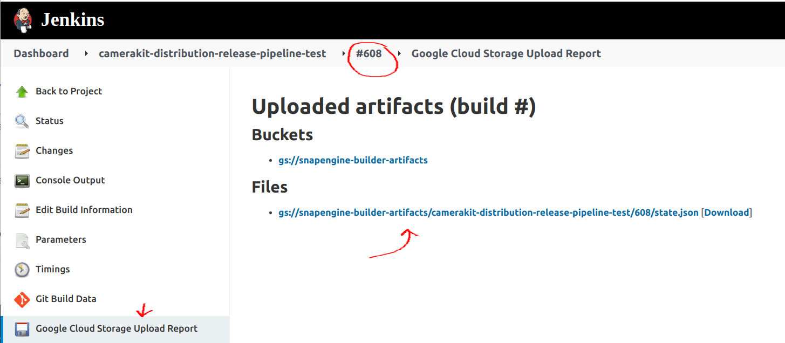

# Camera Kit Jenkins Pipeline

This directory contains Camera Kit Jenkins [Pipeline](https://www.jenkins.io/doc/book/pipeline/) scripts as well as their tests and associated Gradle build code. The main purpose of this project is to drive automation of the Camera Kit SDK release/distribution tasks which previously were manually executed with a help of run-book style scripts. For more information about this project, please see the [doc](https://docs.google.com/document/d/1Cqnu1eIb4B4TRygqUqbi8wzCT_siftzTZ2YXePb0r5Y).

## Jobs

### [camerakit-distribution-release-pipeline](https://snapengine-builder.sc-corp.net/jenkins/job/camerakit-distribution-release-pipeline-test/) 

A long running pipeline workflow job that manages the Camera Kit SDK release process by scheduling various CI jobs, interacting with git as well as communicating with engineers and QA via Slack and Jira. The full pipeline definition can be found [here](./src/main/groovy/com/snap/camerakit/jenkins/pipeline/camerakit-release.groovy).

The pipeline has two optional parameters that significantly change the runtime behavior:

- **TEST_MODE** - boolean where `true` enables the pipeline to run in a test "safe" mode which MUST be used when developing or debugging the pipeline. This mode makes the pipeline to use prefixes for git branches, JIRA issues, Slack channels etc. so that they don't pollute the regular Camera Kit release process.
- **PREDEFINED_STATE_JSON** - pipeline execution state encoded as json string. When the pipeline executes its stages the stage state is written into a `state.json` file that is both persisted into a Jenkins node workspace for immediate inspection as well as uploaded into a GCS bucket for build job results such as this [one](https://console.cloud.google.com/storage/browser/_details/snapengine-builder-artifacts/camerakit-distribution-release-pipeline-test/560/state.json;tab=live_object). Another example of the state json can be found [here](./src/test/resources/state_example_1.json). When json content is provided for this parameter, the pipeline starts/continues from a stage that it can from: most stages have conditional logic on the available state information to skip stage execution yielding to a next stage. This parameter SHOULD be used to re-trigger a previously failed job if it is deemed that it will be possible to continue: a previous job might have failed due to network outage or any other transient issue - triggering a new job with previous state is a perfect case for this parameter. Ideally, the sate json contents SHOULD NOT BE hand edited to prevent incorrect data entry however sometimes one might need to fix and/or workaround an issue so it is OK to do it with enough knowledge of how the pipeline handles the state information internally. 

#### Troubleshooting

##### Jenkins web UI is frozen

The [camerakit-distribution-release-pipeline](https://snapengine-builder.sc-corp.net/jenkins/job/camerakit-distribution-release-pipeline-test/) job may take several days to complete and during this time it generates a lot of logs/data that the Jenkins web UI unfortunately is not capable to handle resulting in freezes when loading the main job page. To workaround this issue, depending on what needs to be done, try the following:

- If you need to navigate to an individual build, note its build number in main page and open a new browser tab going directly to the build page, such as: https://snapengine-builder.sc-corp.net/jenkins/job/camerakit-distribution-release-pipeline-test/609/
- If you need to start a new build, open a new browser tab going directly to https://snapengine-builder.sc-corp.net/jenkins/job/camerakit-distribution-release-pipeline-test/build to trigger a new build. Once triggered, note the build number and navigate to the build page directly, as described above.

##### Restart failed build from saved state

If a build fails due to Jenkins restart or some other unrecoverable issue, start a new build using the saved `state.json` from the failed build which you can obtain by:

- Go to the **Google Cloud Storage Upload Report** page of a failed build such as https://snapengine-builder.sc-corp.net/jenkins/job/camerakit-distribution-release-pipeline-test/608/gcsObjects/ and click on the link pointing to the `state.json`:

    

- On GCS console page, navigate one level up to the directory of the build artifacts:

    

- Click on `state.json` and download it:

    

- Start a new build by opening https://snapengine-builder.sc-corp.net/jenkins/job/camerakit-distribution-release-pipeline-test/build and pasting the contents of the downloaded `state.json` and un-checking the TEST_MODE parameter:

    

## Development

To make development easier - edit with syntax highlighting, code completion - open this project in an Intellij IDE such as Android Studio, it can easily be installed using the [Jetbrains Toolbox App](https://www.jetbrains.com/toolbox-app/). 

Pipeline script sources are located in the [src/main/groovy/com/snap/camerakit/jenkins/pipeline](./src/main/groovy/com/snap/camerakit/jenkins/pipeline) directory. When running a script on a Jenkins machine, point it to the exact script file such as [jenkinsfile-release.groovy](./src/main/groovy/com/snap/camerakit/jenkins/pipeline/camerakit-release.groovy). Running the scripts locally is not really possible without bootstrapping a Jenkins instance however it is possible to test them via unit/integration tests that are located in [src/test/groovy/com/snap/groovy/com/snap/camerakit/jenkins/pipeline](./src/test/groovy/com/snap/camerakit/jenkins/pipeline) directory. To execute tests locally, run `./gradlew test` in CLI or execute them via the IDE run menu. 

After changes are made, commit them and push the branch to the remote origin and point Jenkins job to your branch and and your pipeline script - the job can the be triggered with or without parameters depending on the script setup.
