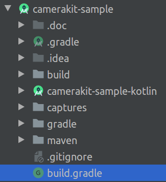
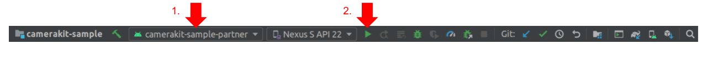
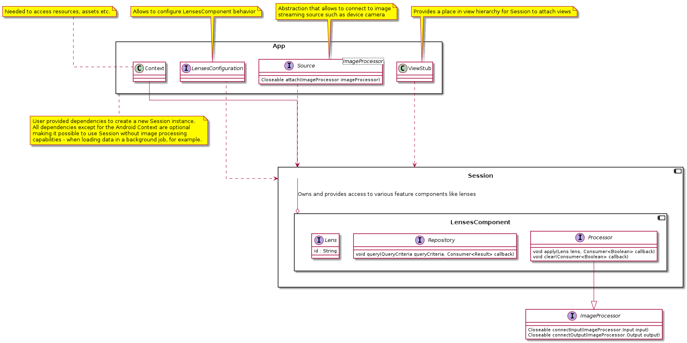
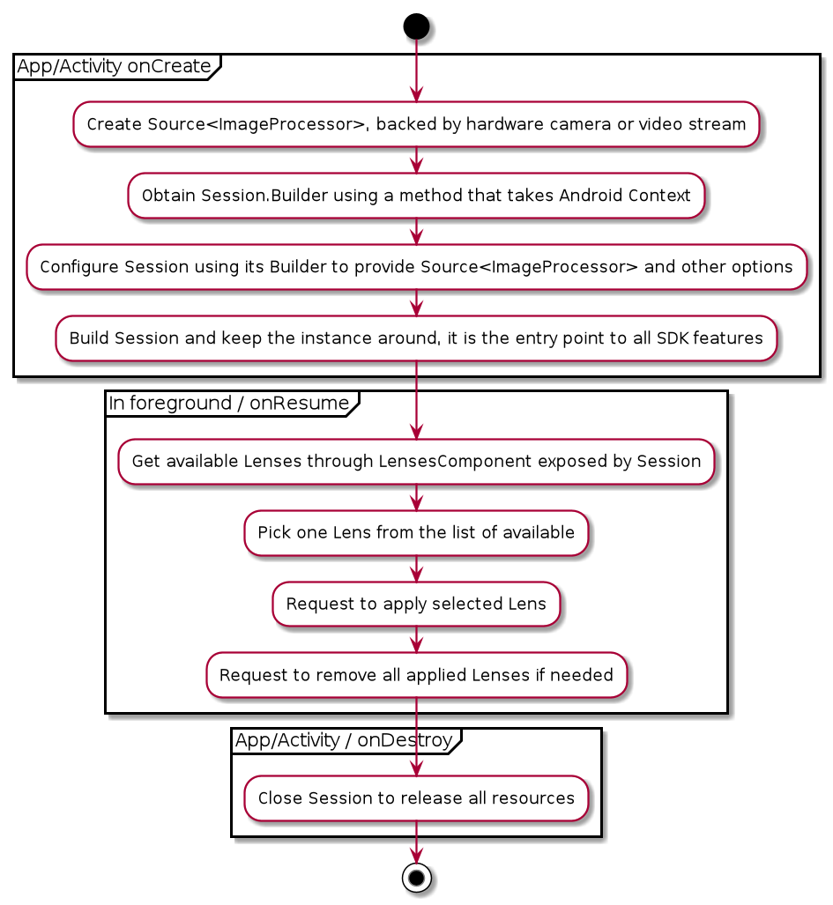

# CameraKit Samples for Android

Demonstrates uses of CameraKit SDK on the Android platform. To get started with building and testing, make sure that the following requirements are met:  

## Requirements

- Recent Android Studio (3.5+), download latest at: https://developer.android.com/studio.
- CameraKit is not supported to run in x86 based emulators therefore a real Android device, with a minimum SDK API level of 21, is required. 

## Installation

To build and install the `camerakit-sample-partner` to a connected phone:

### Command line

`./gradlew camerakit-sample-partner:installDebug`

### IDE

Open the 'camerakit-sample' project in Android Studio by opening the root `build.gradle` file:



Select the `camerakit-sample-partner` module configuration and click run:



## Explore

### Build

The current version of CameraKit SDK is not yet available on public Maven repositories however this project includes an embedded [maven](./maven) repository of all CameraKit artifacts required to build. All CameraKit artifacts are published under a single version and it is possible to pick and choose the dependencies necessary for a specific project:

```groovy
    implementation "com.snap.camerakit:camerakit-partner:$cameraKitVersion"
    implementation "com.snap.camerakit:camerakit-kotlin:$cameraKitVersion"
    implementation "com.snap.camerakit:lenses-bundle-partner:$cameraKitVersion"
    implementation "com.snap.camerakit:support-camerax:$cameraKitVersion"
```

CameraKit is built targeting Java8 bytecode which required to enable Java8 compatibility (desugar) support via Android Gradle Plugin (AGP) `compileOptions`:

```groovy
android {
    compileOptions {
        sourceCompatibility JavaVersion.VERSION_1_8
        targetCompatibility JavaVersion.VERSION_1_8
    }
}
``` 

*For more information, see build configuration in `camerakit-sample-partner` [build.gradle](./camerakit-sample-partner/build.gradle).*

### Components

The main point of entry to all CameraKit SDK features is the `Session` interface which can be built using a traditional builder which allows to customize certain aspects of the SDK such as lenses data sources etc. A simplified diagram of components that the `Session` is composed of can be seen below:



### Lifecycle

The basic use of CameraKit and its lifecycle can be presented as:



### Implementation

CameraKit's main target is Kotlin projects however the base `camerakit-partner` module does not depend or require Kotlin to function (Kotlin projects can use `camerakit-kotlin` for official extensions). The API CameraKit exposes is Java friendly. Here is an example of applying a lens with CameraKit in Java:

```java
public final class BasicActivity extends AppCompatActivity implements LifecycleOwner {

    private Session cameraKitSession;

    @Override
    protected void onCreate(@Nullable Bundle savedInstanceState) {
        super.onCreate(savedInstanceState);

        setContentView(R.layout.activity_main);

        // CameraKit support implementation of ImageProcessor that is backed by CameraX library:
        // https://developer.android.com/training/camerax
        CameraXImageProcessorSource imageProcessorSource = new CameraXImageProcessorSource( 
            this /*context*/, this /*lifecycleOwner*/
        );
        imageProcessorSource.startPreview(true /*cameraFacingFront*/);

        cameraKitSession = Sessions.newBuilder(this)
                .imageProcessorSource(imageProcessorSource)
                .attachTo(findViewById(R.id.camerakit_stub))
                .build();
    }

    @Override
    protected void onResume() {
        super.onResume();
        cameraKitSession.getLenses().getRepository().get(new Available("1"), available -> {
            Log.d(TAG, "Available lenses: " + available);
            Lenses.whenHasFirst(available, lens -> cameraKitSession.getLenses().getProcessor().apply(lens, result -> {
                Log.d(TAG,  "Apply lens [" + lens + "] success: " + result);
            }));
        });
    }

    @Override
    protected void onPause() {
        cameraKitSession.getLenses().getProcessor().clear(result -> {
            Log.d(TAG,  "Clear lenses success: " + result);
        });
        super.onPause();
    }

    @Override
    protected void onDestroy() {
        cameraKitSession.close();
        super.onDestroy();
    }
}
``` 
