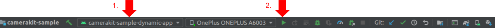

# CameraKit Sample Dynamic

Demonstrates how to integrate CameraKit SDK into an app that loads the SDK dynamically as an on-demand feature. Dynamic loading is useful for use cases where size of the CameraKit SDK is considered to be too big to be included together with the core app features. To support such use cases, the public CameraKit interfaces and classes are available in a separate `camerakit-api` Maven artifact that should have everything nececessary to interface with CameraKit SDK in the core app.

The sample [`app`](./app) uses Google Play split apk / [app bundle](https://developer.android.com/guide/app-bundle) loading support to install the dynamic [`ondemand`](./ondemand) module that provides a simple interface to load CameraKit SDK interface implementation when required. In this specific sample app, the CameraKit SDK is installed and loaded when user clicks on the **INSTALL CAMERAKIT** button, if the installation and CameraKit SDK loading is successful, then the user is presented with a list of available lenses:

## Build

To build, install and launch `camerakit-sample-dynamic-app` with `camerakit_sample_dynamic_ondemand` feature splits included on a connected device:

### Command Line

- `./gradlew camerakit-sample-dynamic-app:installApkSplitsForTestDebug`

- `adb shell am start -n com.snap.camerakit.sample.dynamic.app/com.snap.camerakit.sample.MainActivity`

### IDE

Select the `camerakit-sample-dynamic-app` module configuration and click run:

