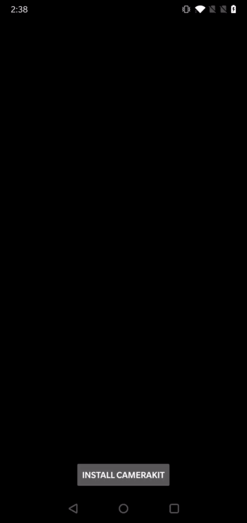

# CameraKit Sample Dynamic

Demonstrates how to integrate CameraKit SDK into an app that loads the SDK dynamically as an on-demand feature. Dynamic loading is useful for use cases where size of the CameraKit SDK is considered to be too big to be included together with the core app features. To support such use cases, the public CameraKit interfaces and classes are available in a separate `camerakit-api` and special `camera-kit-plugin-api` Maven artifacts that should have everything nececessary to interface with CameraKit SDK in the core app.

The sample [`app`](./app) loads CameraKit SDK through the provided `Plugin.Loader` interface by looking up the implementation [`plugin`](./plugin) app of known package ID installed as a separate apk. When user clicks on the **START CAMERAKIT** button, we attempt to load `Plugin` from a separate apk and, if loading of the CameraKit `Plugin` is successful, we then present user with a list of available lenses that can can be clicked on to preview:

## Build

To build, install and launch `camerakit-sample-dynamic-app` with:

-  `camerakit-sample-dynamic-plugin` installed separately on a connected device:

    - Command Line

        - `./gradlew camerakit-sample-dynamic-app:installDebug`
        
        - `./gradlew camerakit-sample-dynamic-plugin:installDebug`
        
        - `adb shell am start -n com.snap.camerakit.sample.dynamic.app/com.snap.camerakit.sample.MainActivity`
