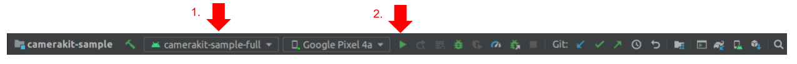
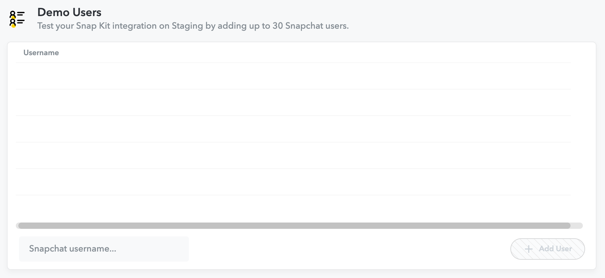
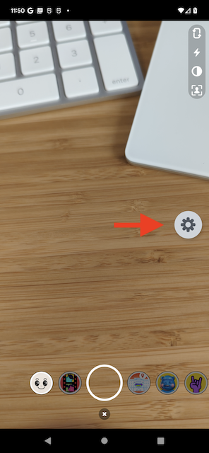
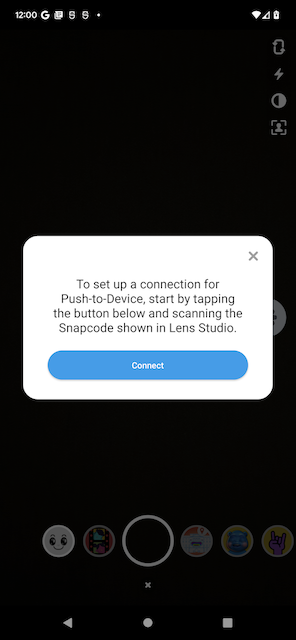
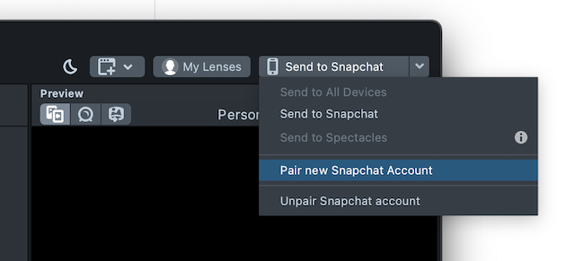
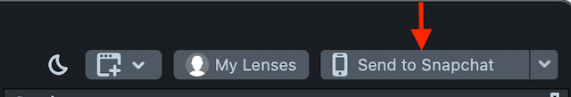

# Camera Kit Sample Full App

An app that opens into a camera screen where user can capture photos or videos with lenses applied:


## Build

To build, install and launch the `camerakit-sample-full` on a connected device:

### Command Line

- `./gradlew camerakit-sample-full:installDebug`

- `adb shell am start -n com.snap.camerakit.sample.full/com.snap.camerakit.sample.MainActivity`

### IDE

Select the `camerakit-sample-full` module configuration and click run:



## Push-to-Device (P2D)

This app can also receive lenses from Lens Studio via the `camerakit-extension-lens-push-to-device-core` integration. This makes it easy for you to test lenses before publishing them.

### P2D Integration

To integrate P2D:

1. Add the P2D module to your build dependency

    ```
    debugImplementation "com.snap.camerakit:camerakit-extension-lens-push-to-device-core:cameraKitVersion"
    ```

2. Follow [LoginKit Integration](#LoginKit-Integration) section below. LoginKit is used for authentication so that Lens Studio and your device can be paired together.
    - Add the `https://auth.snapchat.com/oauth2/api/camkit_lens_push_to_device` scope to the LoginKit scope configuration.
    - Note: Make sure to use the `staging` oAuth2 clientId, since P2D is not meant to work for `production`.
    - Note: In order to log in with accounts while using the `staging` oAuth2 clientId, your account needs to be added to the `Demo Users` list on `kit.snapchat.com/manage/apps/<your-app-id>`.

    

3. Configure the P2D extension using either the `scoped` or `unscoped` API.
    - Use the `scoped` API if you have the `LensesComponent.Builder` context.

        ```
        configureLenses {
            configurePushToDevice {
                authTokenProvider(loginKitAuthTokenProvider)
            }
        }
        ```
    - Use the `unscoped` API if you do not have the `LensesComponent.Builder` context.

        ```
        val globalConfigurationCloseable = LensPushToDeviceService.configure {
            authTokenProvider(loginKitAuthTokenProvider)
        }
        ```

4. Subscribe for the P2D lens groupId:

    ```
    private val LENS_GROUPS = arrayOf(
        ...
        LensPushToDeviceService.LENS_GROUP_ID,
        ...
    )
    ```

### P2D Workflow

1. Once P2D and LoginKit are integrated, you should see a new movable floating icon in your app.

    

2. Tap the icon to bring up the P2D menu, which can be used to start the pairing process.

    

3. Scan the Snapcode presented by Lens Studio.

    

4. Enter the LoginKit credentials, and then pairing should succeed. P2D floating icon should turn green to indicate success.

5. When you are ready to test your lens, kick off the push flow from Lens Studio.

    

## LoginKit Integration

To integrate LoginKit, which is a dependency for modules like P2D:

1. Add the following build dependency: `implementation "com.snap.camerakit:camera-kit-extension-auth-token-provider-loginkit:$cameraKitVersion"`
2. Add the following array where scopes are requested. The below example includes the scope required for P2D.

    ```
    <array name="snap_connect_scopes">
        <item>https://auth.snapchat.com/oauth2/api/camkit_lens_push_to_device</item>
    </array>
    ```

3. Define `clientId`, `redirectUrl`, `scheme`, `host`, and `path` in your application's `manifestPlaceholders`. The information for these fields can be retrieved and/or configured from the [CameraKit portal](https://kit.snapchat.com/).

    ```
    manifestPlaceholders = [
        ...
        clientId                : <fill_in>,
        redirectUrl             : <fill_in>,
        scheme                  : <fill_in>,
        host                    : <fill_in>,
        path                    : <fill_in>,
    ]
   ```

4. In your application's `AndroidManifest.xml`, add the following:

    ```
    <meta-data
        android:name="com.snap.kit.clientId"
        android:value="${clientId}"
        />
    <meta-data
        android:name="com.snap.kit.redirectUrl"
        android:value="${redirectUrl}"
        />
    <meta-data
        android:name="com.snap.kit.scopes"
        android:resource="@array/snap_connect_scopes"
        />
    ```

    ```
    <activity
      android:name="com.snap.corekit.SnapKitActivity"
      android:launchMode="singleTask"
      android:exported="true"
      >

      <intent-filter>
          <action android:name="android.intent.action.VIEW" />

          <category android:name="android.intent.category.DEFAULT" />
          <category android:name="android.intent.category.BROWSABLE" />

          <data
              android:scheme="${scheme}"
              android:host="${host}"
              android:path="${path}"
              />
      </intent-filter>
    </activity>
    ```

5. Now you can use it as such: `val loginKitAuthTokenProvider = LoginKitAuthTokenProvider(applicationContext)`
