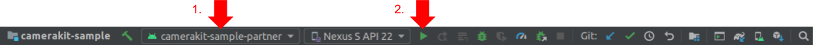

# CameraKit Sample Partner App

An app that opens into a camera screen where user can capture photos or videos with lenses applied:

## Build

To build, install and launch the `camerakit-sample-partner` on a connected device:

### Command Line

- `./gradlew camerakit-sample-partner:installDebug`

- `adb shell am start -n com.snap.camerakit.sample.partner/com.snap.camerakit.sample.MainActivity`

### IDE

Select the `camerakit-sample-partner` module configuration and click run:

